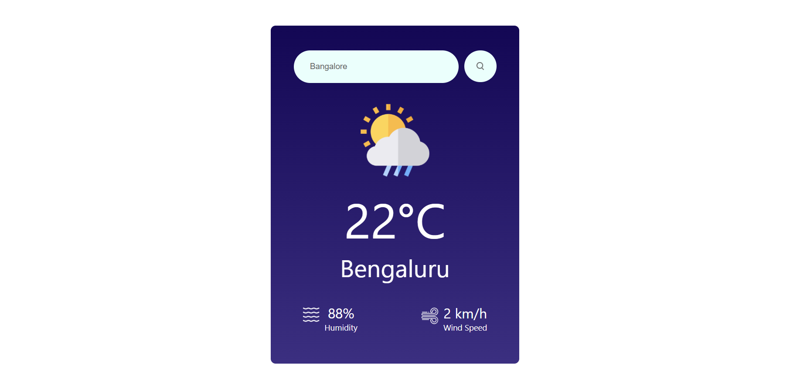

# [Weather App](https://656b5e247bad5360e4c6bf77--gentle-mooncake-685902.netlify.app/) using OpenWeatherMap API and React.js



## Overview

This Weather App is a straightforward web application built with React.js to provide users with real-time weather information for any location. The application utilizes the OpenWeatherMap API for fetching accurate and up-to-date weather data.

## Features

- **Current Weather**: Get the current temperature, weather conditions, and other relevant details for a chosen location.
- **Search by City**: Easily search for weather information in any city around the world.

## Technologies Used

- **React.js**: A JavaScript library for building user interfaces.
- **OpenWeatherMap API**: Provides weather data for any location globally.

## Installation

1. Clone the repository:

    ```bash
    git clone https://github.com/pandeydhruv2001/weather-app.git
    cd weather-app
    ```

2. Install dependencies:

    ```bash
    npm install
    ```

3. Open `WeatherApp.jsx` and replace `'Your API Key'` with your actual API key:

    ```javascript
    // src/Components/Weather App/WeatherApp.jsx

    let api_key = 'YOUR_API_KEY';
    ```

4. Install dependencies:

    ```bash
    npm install
    ```

5. Start the application:

    ```bash
    npm start
    ```

    Visit `http://localhost:3000` in your browser to see the Weather App in action.

## Configuration

Make sure to replace `'YOUR_API_KEY'` in the `src/Components/Weather App/WeatherApp.jsx` file with your OpenWeatherMap API key.

```javascript
// src/Components/Weather App/WeatherApp.jsx

let api_key = 'YOUR_API_KEY';
```

## Acknowledgments

This Weather App was developed as part of the tasks at Compozent during the Full Stack Developer Internship.

Weather data is provided by the [OpenWeatherMap API](https://openweathermap.org/api). Refer to their documentation for more details on the API.

## Resources

- [React Documentation](https://reactjs.org/docs/getting-started.html)
- [OpenWeatherMap API Documentation](https://openweathermap.org/api)

## License

This Weather App is open-source software licensed under the MIT License. See the [LICENSE](LICENSE) file for more information.

